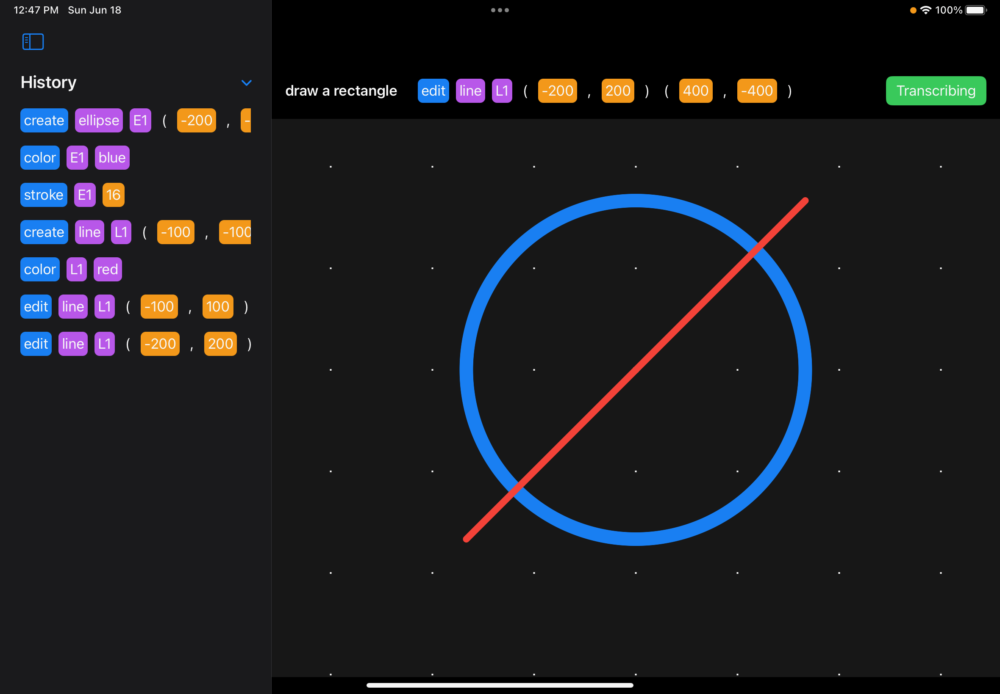
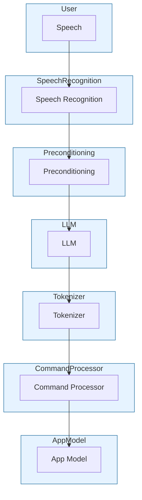

# AccessAbility

## Description
**AccessAbility** provides a natural language control surface for complex apps.

Any app can register a mini-grammar with AccessAbility and allow natural language to be used to execute complex actions in the app.

## Pipeline

